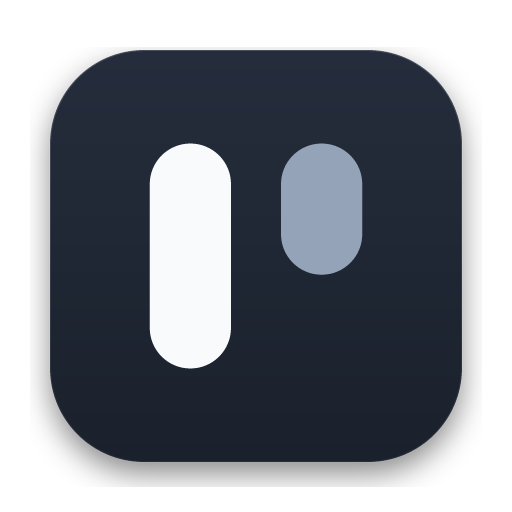

<p align="center" style="margin:0">
  
</p>

<h1 align="center" style="margin-top: 16px;">Premire</h1>

<p align="center">
  <strong>Next-Generation Autonomous AI Code Studio</strong><br />
  A high-performance, locally running AI-native development environment built with Tauri v2, Rust, React, and Monaco.
</p>

<p align="center">
  <a href="https://github.com/S1sTeam/Premiere">GitHub</a> ·
  <a href="https://github.com/S1sTeam/Premiere/releases/latest">Download</a> ·
  <a href="https://t.me/sysgood">Telegram</a> ·
  <a href="mailto:kloxaisupport@gmail.com">Contact</a> ·
  <a href="README-RU.md">Русский</a> ·
  <a href="README-ZH-TW.md">繁體中文</a>
</p>

<p align="center">
  <a href="https://github.com/S1sTeam/Premiere/actions"></a>
  <a href="https://github.com/S1sTeam/Premiere/releases"></a>
  <a href="LICENSE"></a>
  
  
  
  
  
</p>

---

## 🚀 Overview

Premire is an open-source, locally running agentic software development environment. It combines an autonomous AI conversation workspace, multi-tab code editor, source control, integrated terminal, language server (LSP) integration, Model Context Protocol (MCP) server support, sub-agent research workflows, and an isolated agent-driven browser inside one ultra-responsive desktop application.

### Key Highlights

- **Autonomous Agentic Workflow** — Streamed reasoning, multi-turn tool execution, real-time file diffs, rollbacks, token usage accounting, prompt caching, and intelligent context compaction.
- **Isolated Browser Automation** — Dedicated Chromium session controlled via Chrome DevTools Protocol (CDP) for browsing, visual validation, web testing, and web research.
- **Complete Development Workspace** — Monaco editor with diff views, real-time project tree, ignore-aware global search, Git staging/history/commit graph, and tabbed xterm.js terminal with shell detection.
- **Extensible Tools & MCP** — Built-in filesystem, shell, Git, web, browser, todo, skill, and sub-agent research tools, alongside dynamic stdio/JSON-RPC 2.0 MCP server integration.
- **Provider Freedom** — Native support for Anthropic, OpenAI, Google Gemini, DeepSeek, Groq, OpenRouter, Mistral, Ollama, LM Studio, vLLM, and any custom OpenAI-compatible endpoint.
- **Deep Customization** — 40 bundled themes, editable light and dark palettes, custom fonts, window zoom, and 38 selectable interface languages.

---

## 📦 Downloads & Installation

Pre-built binaries and native installers for all major platforms are available on the [Releases](https://github.com/S1sTeam/Premiere/releases/latest) page:

| Platform | Architecture | Installer / Package |
|:---|:---|:---|
| **Windows** | x64 | [`.exe` (NSIS Installer)](https://github.com/S1sTeam/Premiere/releases/latest), [`.msi`](https://github.com/S1sTeam/Premiere/releases/latest) |
| **macOS** | Apple Silicon (M1/M2/M3/M4) / Intel | [`.dmg`](https://github.com/S1sTeam/Premiere/releases/latest), [`.app`](https://github.com/S1sTeam/Premiere/releases/latest) |
| **Linux** | x64 | [`.AppImage`](https://github.com/S1sTeam/Premiere/releases/latest), [`.deb`](https://github.com/S1sTeam/Premiere/releases/latest), [`.rpm`](https://github.com/S1sTeam/Premiere/releases/latest), [`.tar.gz`](https://github.com/S1sTeam/Premiere/releases/latest) |

---

## 🛠️ Architecture

Premire is designed around modular, security-focused layers:

- **Renderer (`src/`)**: React 18, TypeScript, Monaco Editor, Tailwind/CSS custom properties, and Zazaru design system.
- **Desktop Host (`src-tauri/`)**: Tauri v2 application host managing window lifecycle, system tray, and native dialogs.
- **Core Engine (`crates/`)**: 16 focused Rust crates providing secure execution boundaries:
  - `agent` & `agent-api`: Multi-turn planner, reasoning stream, state machine, and compaction.
  - `agent-tool`: Secure filesystem operations, safe path containment, shell runner, and sub-agents.
  - `browser`: Managed Chromium automation and screenshot capture via CDP.
  - `llm`: Provider abstractions, SSE parsers, and token metrics.
  - `mcp`: JSON-RPC 2.0 stdio server discovery and schema registration.
  - `fs` & `search`: Ignore-aware path traversal and bounded code search.
  - `git`: Git repository operations via libgit2.
  - `db` & `chats`: SQLite persistence for workspaces and chat sessions.
  - `terminal`: Native pseudo-terminal (PTY) management.

---

## 💻 Building from Source

### Prerequisites

- [Node.js](https://nodejs.org/) `>= 18`
- [Rust](https://rustup.rs/) stable toolchain (`cargo`, `rustc`)
- Platform-specific build tools:
  - **Windows**: Visual Studio C++ Build Tools
  - **macOS**: Xcode Command Line Tools
  - **Linux**: `libwebkit2gtk-4.1-dev`, `libgtk-3-dev`, `libsoup-3.0-dev`, `libjavascriptcoregtk-4.1-dev`, `libappindicator3-dev`, `librsvg2-dev`

### Setup and Local Development

```bash
# Clone the repository
git clone https://github.com/S1sTeam/Premiere.git
cd Premiere

# Install dependencies (automatically sets up Monaco Editor assets)
npm install

# Start development mode (Vite frontend + Tauri desktop window)
npm run dev
```

### Verification & Testing

```bash
# Typecheck
npm run typecheck

# Run test suite (Vitest)
npm test

# Production build (Frontend & Native Desktop bundle)
npm run build
```

---

## 📄 License

Premire is open-source software distributed under the [GNU General Public License v3.0](LICENSE).
